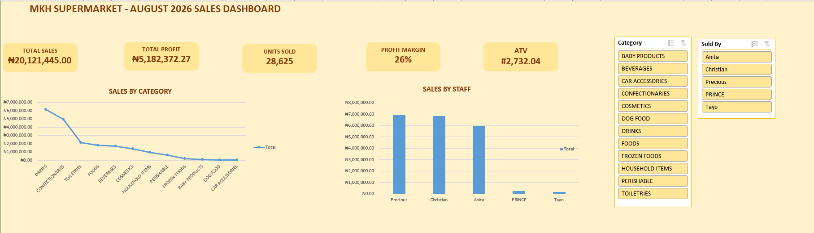
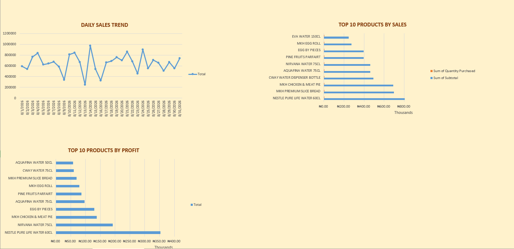

MKH Supermarket Sales Performance Analysis

Project Overview

An end-to-end analysis of August 2026 supermarket sales data to understand sales performance, product trends, profitability, and operational patterns.

This project demonstrates how raw sales data can be cleaned, analyzed, and transformed into meaningful business insights using Excel and Power Query.

Tools Used

* Microsoft Excel
* Power Query

Reporting Period

August 1–31, 2026

Business Questions

This analysis explored key questions including:

* What were the overall sales and profit performance?
* Which product categories generated the highest sales?
* Which products performed strongly by sales and profit?
* How did sales vary across staff?
* How did sales change throughout the month?
* What business areas require attention based on the data?

Data Preparation & Cleaning

The original dataset required several cleaning and preparation steps, including:

* Correcting date formatting and parsing issues.
* Cleaning inconsistent Sales ID entries.
* Removing unnecessary fields.
* Retaining relevant fields for analysis.
* Refreshing the Power Query data to ensure the cleaned dataset loaded without errors.

The final dataset contained 17,499 sales records for August 2026.

Key KPIs

KPI	Result
Total Sales	₦20,121,445.00
Total Profit	₦5,182,372.27
Units Sold	28,625
Profit Margin	25.76%
ATV	₦2,732.04

Key Insights

* Total sales for the period were approximately ₦20.12 million, generating approximately ₦5.18 million in profit.
* Sales were concentrated across several major product categories, with Drinks and Confectioneries among the highest-selling categories.
* Water products showed strong performance, including Nestle Pure Life Water 60cl and Nirvana Water 75cl.
* Sales performance varied across staff during the reporting period.
* Daily sales fluctuated throughout August.
* Payment records containing multiple payment methods limited detailed payment-method attribution.

Business Recommendations

* Prioritize high-performing products during inventory planning.
* Monitor product profitability alongside sales volume.
* Improve inventory planning using product performance trends.
* Monitor lower-performing categories and products.
* Consider staff performance alongside working hours, shifts, and customer traffic.
* Improve the structure of payment data to support more accurate payment-method analysis.
* Establish regular sales performance monitoring.

Data Limitations

* The analysis covers August 1–31, 2026 only.
* Some payment records contained multiple payment methods in a single record.
* Staff performance cannot be fully evaluated without information such as working hours, shifts, and customer traffic.
* External factors such as promotions, seasonality, competitor activity, and customer behavior were not included in the dataset.

Project Outcome

The analysis transformed raw supermarket sales data into a structured business analysis covering sales performance, product trends, profitability, staff contribution, and daily sales patterns.

The findings provide practical insights that can support inventory planning, performance monitoring, and data-driven decision-making.

Dashboard

The project dashboard was developed in Excel to visualize key performance indicators, category performance, staff sales, daily sales trends, and top-performing products.

Workbook Structure

The Excel workbook contains the following sections:
* Raw Data- Original sales data.
* Cleaned Data- Data prepared and cleaned using Power Query.
* Pivot Tables- Summarized data used for analysis.
* Analysis- Key metrics, KPIs, and supporting calculations.
* Dashboard- Interactive dashboard presenting the main findings and performance trends.
  
### Dashboard Preview

